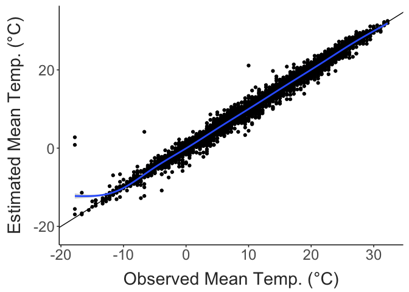
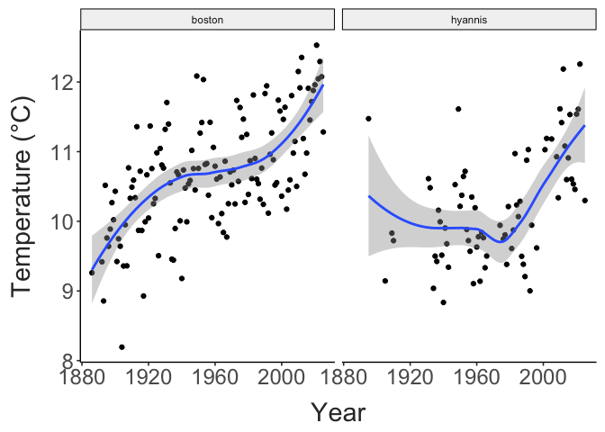
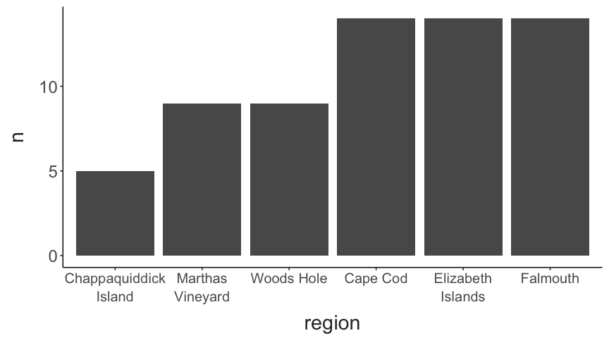
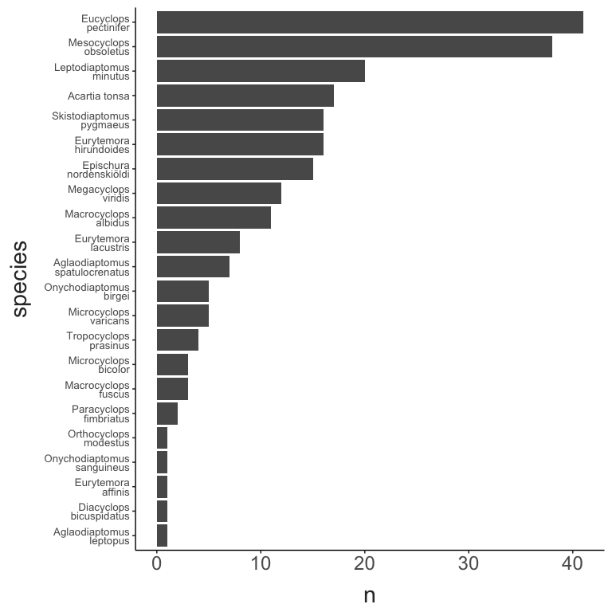
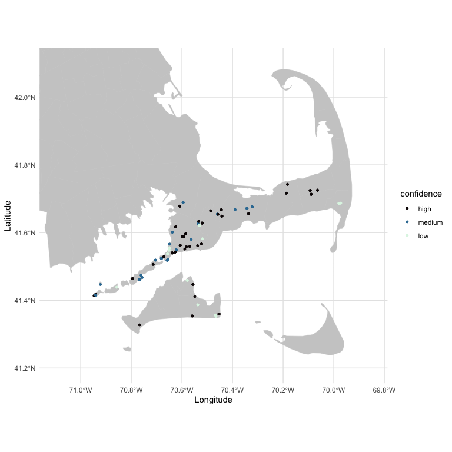
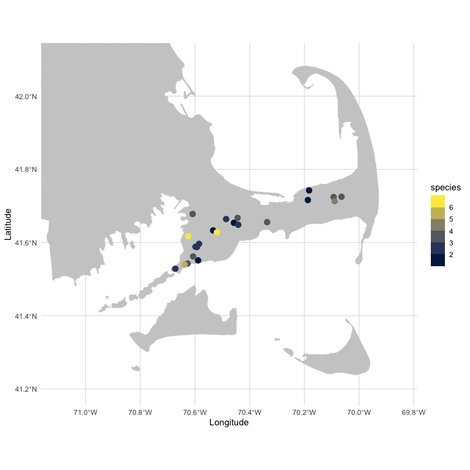

TITLE HERE
================
2026-03-08

- [Historical Temperature Data](#historical-temperature-data)
- [Taxonomic Diversity](#taxonomic-diversity)
- [Potential Sites for Resampling](#potential-sites-for-resampling)

## Historical Temperature Data

Daily temperature data was retrieved from the National Centers for
Environmental Information from three sites in Boston (Station
USW00094701 in Boston, Station USC00191097 in Cambridge, and Station
USW00014739 at Boston Logan International Airport) and a site in
Hyannis. Only maximum and minimum daily temperatures were recorded for
the historical data (\<1950). To assemble a complete data record, daily
maximum and minimum values were first averaged for each day to account
for temporal overlap between the data sets. The mid-point between the
minimum and maximum was then used a proxy for the daily mean
temperature.

This method produced reasonable estimates for the daily mean
temperature. There was a tight correlation between estimated and
observed mean daily temperatures.

``` r
ggplot(temp_record, aes(x = mean, y = mean_est)) + 
  geom_abline(slope = 1) + 
  geom_point() + 
  geom_smooth() + 
  labs(x = "Observed Mean Temp. (°C)",
       y = "Estimated Mean Temp. (°C)") + 
  theme_matt()
```



``` r
cor.test(x = temp_record$mean_est, y = temp_record$mean)
## 
##  Pearson's product-moment correlation
## 
## data:  temp_record$mean_est and temp_record$mean
## t = 797.22, df = 7198, p-value < 2.2e-16
## alternative hypothesis: true correlation is not equal to 0
## 95 percent confidence interval:
##  0.9941202 0.9946378
## sample estimates:
##      cor 
## 0.994385
```

The temperature record suggests distinct warming in Eastern
Massachusetts since the 1880s. While the temperature record is more
sparse, there also seems to have been substantial record on Cape Cod,
especially over the past 50 years.

``` r
temp_record %>%  
  drop_na(mean_est) %>% 
  group_by(year, location) %>%  
  summarise(ann_mean = mean(mean_est, na.rm = T),
            ann_max = max(max, na.rm = T),
            ann_min = min(min, na.rm = T)) %>% 
  ungroup(year) %>% 
  filter(year != max(year) & year != min(year)) %>% 
  pivot_longer(cols = c(ann_mean:ann_min), 
               names_to = "metric", 
               values_to = "temp") %>% 
  filter(metric == "ann_mean") %>% 
ggplot(aes(x = year, y = temp)) + 
  facet_wrap(location~.) + 
  geom_point() + 
  geom_smooth() +
  labs(x = "Year", 
       y = "Temperature (°C)") + 
  theme_matt() + 
  theme(legend.position = "right")
```



## Taxonomic Diversity

The number of species varies across regions, but is generally correlated
with the region area / number of sites sampled.

``` r
database %>% 
  select(species, region) %>%
  distinct() %>% 
  group_by(region) %>% 
  count() %>% 
  drop_na() %>% 
  ungroup() %>% 
  mutate(region = fct_reorder(region, n)) %>% 
  ggplot(aes(x = region, y = n)) + 
  geom_bar(stat = 'identity') + 
  scale_x_discrete(labels = function(x) str_wrap(x, width = 15)) + 
  theme_matt() +
  theme(axis.text.x = element_text(size = 15))
```



It’s clear, however, that the species recorded vary in their
distributions, with species occurrences ranging from 1 to 41 sites.

``` r
database %>% 
  group_by(species) %>% 
  count() %>% 
  drop_na() %>% 
  ungroup() %>% 
  mutate(species = fct_reorder(species, n)) %>% 
  ggplot(aes(x = species, y = n)) + 
  geom_bar(stat = 'identity') + 
  scale_x_discrete(labels = function(x) str_wrap(x, width = 15)) + 
  coord_flip() + 
  theme_matt() + 
  theme(axis.text.y = element_text(size = 10, lineheight = 0.7))
```



``` r

# Download County Subdivision shapefiles for MA
# Using county subdivisions (cousub) usually provides better coastal detail
ma_map <- county_subdivisions(state = "MA", cb = TRUE, class = "sf")

ggplot(data = ma_map) +
  geom_sf(fill = "grey80", color = "grey80") +
  theme_minimal() +
  geom_point(data = drop_na(database, lat), aes(x = long, y = lat, colour = confidence),
             size = 1) + 
  scale_color_viridis_d(option = "G") + 
  # scale_colour_manual(values = c("high" = "black",
  #                                "medium" = "grey50",
  #                                "low" = "grey80")) + 
  coord_sf(xlim = c(-69.85, -71.1),
           ylim = c(41.2,42.1)) + 
  labs(x = "Longitude",
       y = "Latitude") +
  theme(panel.grid.major = element_line(color = "gray90", linewidth = 0.5))
```



## Potential Sites for Resampling

``` r
database %>%  
  filter(confidence == "high" & salinity == "fresh water" & region %in% c("Cape Cod", "Falmouth", "Woods Hole")) %>% 
  select(species, site, lat, long, region) %>% 
  count(site, lat, long, name = "species") %>% 
  arrange(species) %>% 
  knitr::kable()
```

| site                           |      lat |      long | species |
|:-------------------------------|---------:|----------:|--------:|
| Little Pond                    | 41.55121 | -70.58876 |       1 |
| Ashumet Pond                   | 41.63314 | -70.53373 |       2 |
| Flax Pond (3)                  | 41.71616 | -70.18741 |       2 |
| Santuit Pond                   | 41.65391 | -70.45775 |       2 |
| Scargo Lake                    | 41.74240 | -70.18285 |       2 |
| Browns Pond (Spectacle Pond)   | 41.58780 | -70.59263 |       3 |
| Jenkins Pond                   | 41.59633 | -70.58525 |       3 |
| Lovells Pond                   | 41.64846 | -70.44194 |       3 |
| Mares Pond                     | 41.58843 | -70.59809 |       3 |
| Mashpee Pond (Wakeby Pond)     | 41.66421 | -70.48627 |       3 |
| Mill Pond                      | 41.52849 | -70.67188 |       3 |
| Crescent Lake (Long Pond (2))  | 41.65581 | -70.33640 |       4 |
| Jones Pond                     | 41.56220 | -70.60679 |       4 |
| Long Pond (1)                  | 41.66732 | -70.44426 |       4 |
| Long Pond (3)                  | 41.72509 | -70.06419 |       4 |
| Red Brook Pond                 | 41.67801 | -70.60864 |       4 |
| Salt Pond                      | 41.54250 | -70.62701 |       4 |
| Seymour Pond (Bangs Pond)      | 41.72436 | -70.09312 |       4 |
| Pleasant Lake (Hinckleys Pond) | 41.71307 | -70.08944 |       5 |
| Oyster Pond                    | 41.53975 | -70.63824 |       6 |
| Crockers Pond                  | 41.61685 | -70.62473 |       7 |
| John Pond                      | 41.62797 | -70.51989 |       7 |

For logistical reasons, we will focus resurveying efforts on high
confidence mainland freshwater sites (within Cape Cod, Falmouth, or
Woods Hole). These 22 sites are shown below. The number of species
described at each site are indicated by the color of the point.

``` r

ggplot(data = ma_map) +
  geom_sf(fill = "grey80", color = "grey80") +
  theme_minimal() +
  geom_point(data = resurveys, aes(x = long, y = lat, colour = species),
             size = 3) + 
  coord_sf(xlim = c(-69.85, -71.1),
           ylim = c(41.2,42.1)) + 
  labs(x = "Longitude",
       y = "Latitude") +
  scale_colour_viridis_b(option = "E") + 
  theme(panel.grid.major = element_line(color = "gray90", linewidth = 0.5))
```


